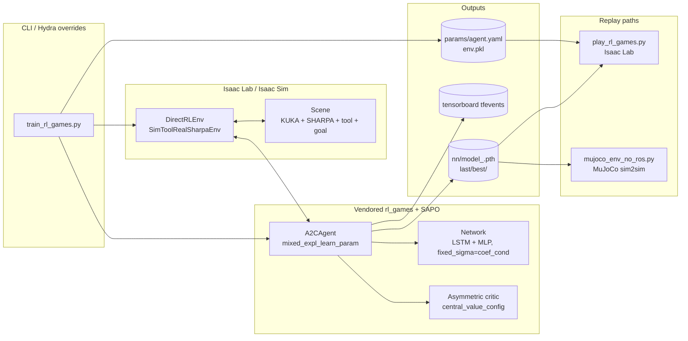
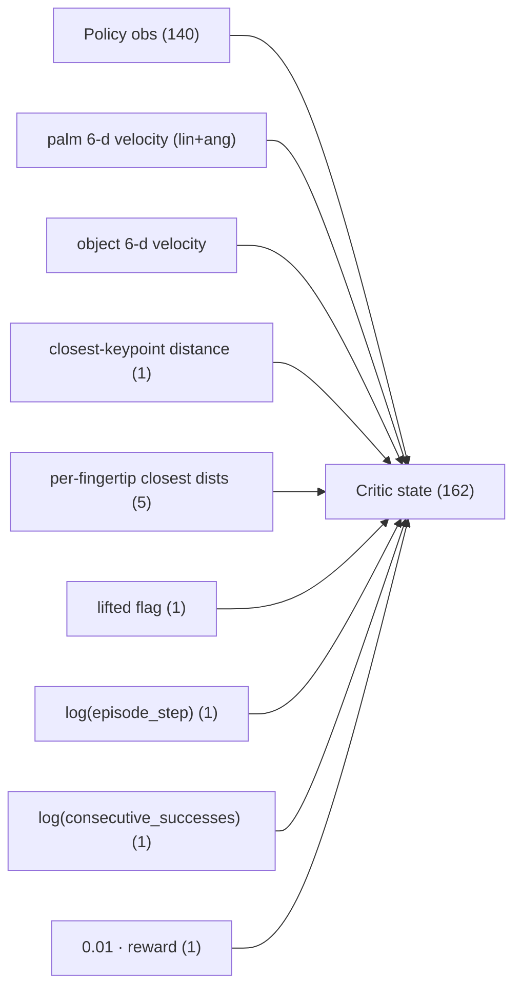
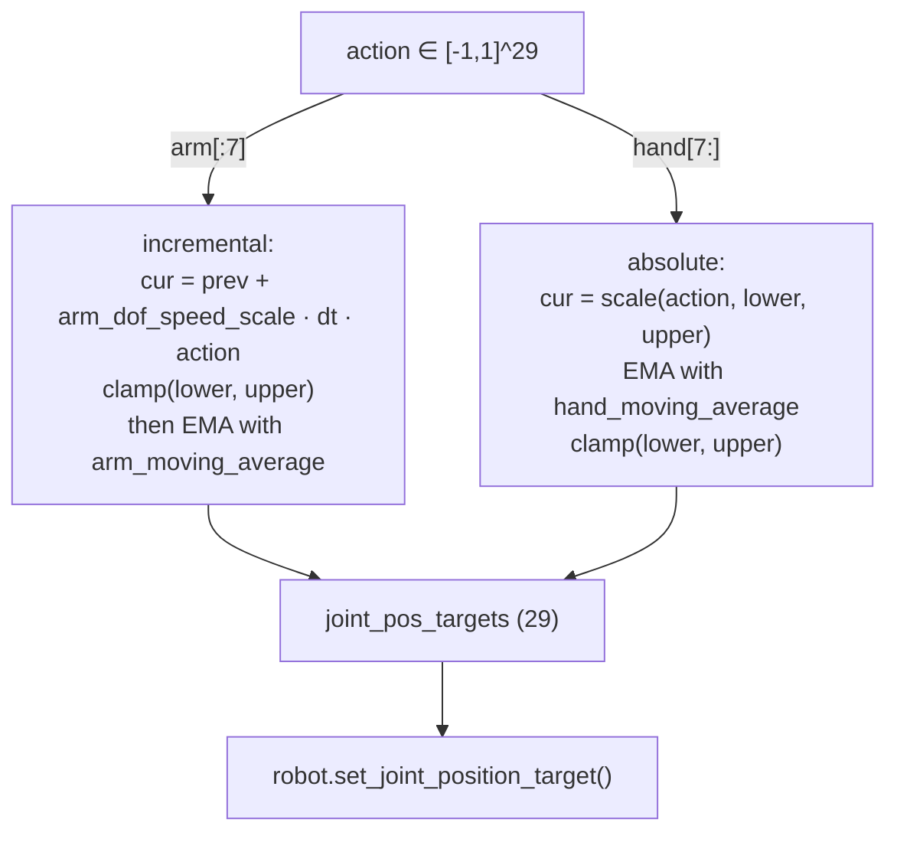
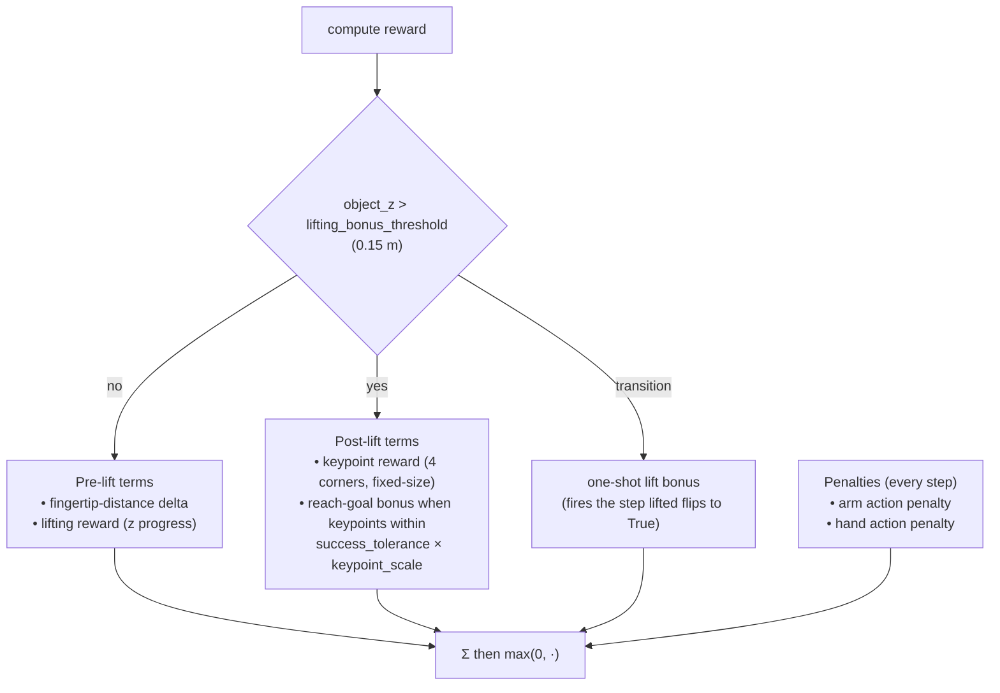
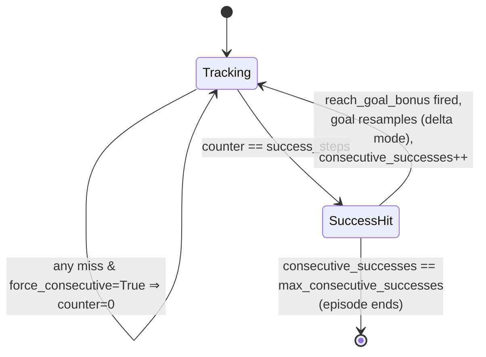
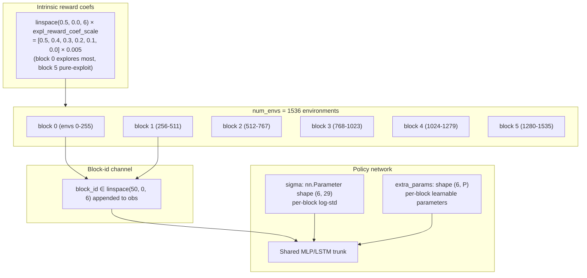
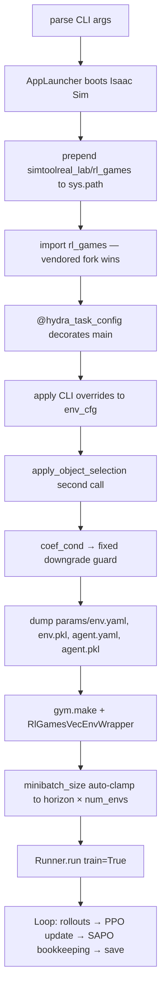
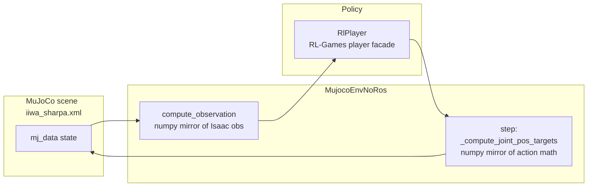
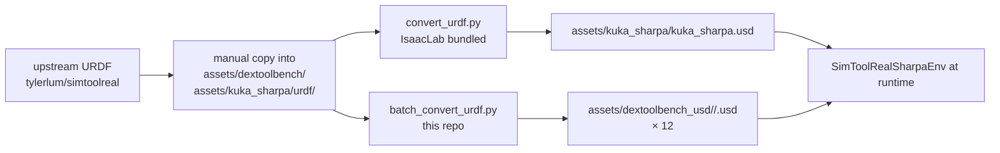

# SimToolReal (Isaac Lab fork) — Codebase Internals

A deep dive into how this repository works: the env, the SAPO-modified PPO trainer, the replay paths, and the contracts that hold them together. Designed for someone who already read the README/`CLAUDE.md` and wants to know **how** rather than **what to run**.

All citations use `path:line` so you can jump to them.

---

## 1. What this code does

A KUKA iiwa14 arm with a left **SHARPA** five-finger hand learns to:

1. **Grasp** a DexToolBench tool (hammer/screwdriver/eraser/spatula/marker/brush — 12 USDs total).
2. **Lift** it above a height threshold.
3. **Reach** a 6-DoF goal pose by aligning four corner keypoints on the tool with the same keypoints on a kinematic goal marker.

Training: PPO with an **asymmetric critic** (policy sees 140 dims, critic sees 162) and **SAPO** mixed exploration (six exploration "blocks" of envs, each with a different intrinsic-reward coefficient and per-block learned policy sigma). Trained with a vendored fork of `rl_games` at `simtoolreal_lab/rl_games/`.

Two inference paths exist:
- **Isaac Lab replay** (`play_rl_games.py`) — same engine as training.
- **MuJoCo sim2sim replay** (`deployment/mujoco/`) — a no-ROS handcrafted MJCF scene that re-implements the obs/action contract in numpy to test that the policy generalizes off the training simulator.

---

## 2. Repository layout (active code only)

```text
simtoolreal_lab/
├── train_rl_games.py                  # Hydra+RL-Games training launcher
├── play_rl_games.py                   # Isaac Lab checkpoint replay
├── tasks/simtoolreal_sharpa/
│   ├── simtoolreal_sharpa_env.py          # DirectRLEnv: obs/reward/reset
│   ├── simtoolreal_sharpa_env_cfg.py      # config + object selection
│   ├── simtoolreal_sharpa_utils.py        # obs name table, action math
│   ├── gym_setup.py                       # gym.register("simtoolreal_sharpa")
│   ├── agents/rl_games_sapo_cfg.yaml      # PPO + SAPO config
│   └── tests/test_load_scene.py
├── rl_games/                          # VENDORED rl_games fork (SAPO mods)
│   └── rl_games/{algos_torch,common}/     # mixed_expl, coef_cond, extra_params
├── deployment/mujoco/                 # sim2sim runtime (no ROS)
│   ├── mujoco_env_no_ros.py               # obs/action bridge to MuJoCo
│   ├── mujoco_sim.py                      # MJCF wrapper
│   └── policy_player.py                   # RL-Games player facade
└── assets/
    ├── kuka_sharpa/                       # URDF + KUKA_SHARPA_CFG
    ├── dextoolbench_usd/                  # 12 tool USDs (gitignored)
    └── mujoco_wasm/scenes/iiwa_sharpa.xml # MuJoCo scene
```

`reference/` (gitignored) holds the original Stanford IsaacGym codebase for parity work.

---

## 3. End-to-end pipeline



The launcher does three things that matter (`train_rl_games.py:60-146`):
1. Calls `apply_object_selection(env_cfg)` (line 69) — **second time**; first call is in `SimToolRealSharpaEnvCfg.__post_init__`. CLI Hydra overrides land between the two calls, so the second one materializes the final choice.
2. Auto-downgrades `fixed_sigma=coef_cond` to `fixed_sigma=fixed` if `expl_type` is not `mixed_expl*` (line 76-78). Without this guard, the policy net would expect block-id columns that never come.
3. Prepends `simtoolreal_lab/rl_games` to `sys.path` (line 40-41) **before** importing `rl_games`. This is how the vendored SAPO fork wins over any pip-installed `rl_games`.

---

## 4. The 140-dim policy observation

Defined declaratively at `simtoolreal_sharpa_utils.py:9-39`. `OBS_NAME_TO_NAMES` maps each group label to its component scalar names, then `OBS_NAMES` flattens them in fixed order. An `assert len(OBS_NAMES) == 140` (line 39) catches drift.

| # | Group | Dim | Source field |
|---|---|---|---|
| 1 | `joint_pos` | 29 | All 29 robot DoFs, normalized to `[-1, 1]` via `unscale(q, lower, upper)` |
| 2 | `joint_vel` | 29 | Raw joint velocities |
| 3 | `prev_action_targets` | 29 | The previous-step **joint-position targets**, not the previous raw action |
| 4 | `palm_pos` | 3 | World position of the palm (link7 + `PALM_OFFSET`) |
| 5 | `palm_rot` | 4 | Palm quaternion **xyzw** |
| 6 | `object_rot` | 4 | Object quaternion **xyzw** |
| 7 | `fingertip_pos_rel_palm` | 15 | 5 fingertips × 3, in palm frame |
| 8 | `keypoints_rel_palm` | 12 | 4 object corner keypoints × 3, in palm frame |
| 9 | `keypoints_rel_goal` | 12 | 4 object keypoints × 3, relative to the corresponding goal keypoints |
| 10 | `object_scales` | 3 | Per-tool x/y/z scale used to size the keypoints |
| **Σ** | | **140** | |

Construction lives in `_compute_reference_observations` at `simtoolreal_sharpa_env.py:607-628`. The MuJoCo replay builds the same vector in numpy at `mujoco_env_no_ros.py:199-242` — the obs list lookup at line 238 must produce the same column order as `OBS_NAMES`.

**Quaternion convention.** Isaac Lab stores quaternions as **wxyz**; the policy contract is **xyzw**. The reorder happens at observation time only — see `quat_wxyz_to_xyzw` at `simtoolreal_sharpa_env.py:23` (torch) and `_quat_wxyz_to_xyzw` at `mujoco_env_no_ros.py:126` (numpy). Do not flip the convention at any other layer.

---

## 5. The 162-dim asymmetric critic state

`_compute_reference_states` at `simtoolreal_sharpa_env.py:630-672` returns a state vector that contains **all 140 policy obs plus 22 privileged extras**:



These get plumbed through `RlGamesVecEnvWrapper` → `central_value_config` in `rl_games_sapo_cfg.yaml:98-116`. The env returns `{"policy": obs, "critic": state}`; do **not** rename those keys.

---

## 6. The 29-dim action and how it's applied

Action shape: `(num_envs, 29)`, range `[-1, 1]`. The first 7 dims drive the iiwa arm; the last 22 drive the SHARPA hand. They are processed completely differently:



Implementation: `compute_joint_pos_targets` at `simtoolreal_sharpa_utils.py:50-74` (torch), called from the env at `simtoolreal_sharpa_env.py:444`. The numpy mirror used by MuJoCo replay is `_compute_joint_pos_targets` at `mujoco_env_no_ros.py:155-171`. **The two implementations must stay byte-identical in behavior.**

Joint-name ordering (`KUKA_SHARPA_JOINT_NAMES`) is load-bearing: the index layout was baked into the reference IsaacGym policy and any reordering silently breaks weights loaded from a checkpoint. The MuJoCo scene uses `palmleft_*` prefixes (`mujoco_sim.py::JOINT_NAMES`) — these are *position-aligned* with the Isaac Lab list but use different strings.

---

## 7. Reward composition

The reward function lives at `simtoolreal_sharpa_env.py:252` (`_get_rewards`). The structure is a **phased reward**: shaping terms change once the object is lifted.



Key thresholds (all in `simtoolreal_sharpa_env_cfg.py`):

| Field | Line | Value | Effect |
|---|---|---|---|
| `object_mass` | 291 | `0.05` | Forced uniform mass via `_apply_object_mass` |
| `keypoint_scale` | 322 | `1.5` | Multiplies success tolerance for keypoint comparison |
| `lifting_bonus_threshold` | 333 | `0.15` | Z-height at which the one-shot lift bonus fires |
| `success_tolerance` | 348 | `0.075` | All 4 keypoints must be within this × `keypoint_scale` |
| `success_steps` | 349 | `10` | Consecutive near-goal steps required for a "success" |
| `max_consecutive_successes` | 350 | `50` | Episode ends after this many successes |
| `force_consecutive_near_goal_steps` | 351 | `True` | The per-step counter **resets** on any miss; you must hold the pose continuously |

The success accounting is a small state machine:



`force_consecutive_near_goal_steps=True` is significant: it disallows "drift-correct-drift-correct" credit hacking. The policy must hold the pose for 10 steps in a row.

---

## 8. Object selection

Three modes, dispatched by `apply_object_selection(env_cfg)` in `simtoolreal_sharpa_env_cfg.py`:

| Mode | Spawn strategy | `replicate_physics` |
|---|---|---|
| `cube` | `make_cube_object_cfg` / `make_cube_goal_object_cfg` (line 189-190) | True |
| `<tool_name>` (12 keys) | `make_dextoolbench_object_cfg` per env, scales from `DEXTOOLBENCH_OBJECT_SCALES` (line 197-198) | True |
| `multi_dextoolbench` | `MultiUsdFileCfg`, one tool per env round-robin (line 205-206) | **False** |

**Critical:** `apply_object_selection` is invoked **twice** — once in `SimToolRealSharpaEnvCfg.__post_init__` and once in the launcher at `train_rl_games.py:69` (and `play_rl_games.py:140`). Hydra overrides land between the two calls, so the second invocation is what actually wins. If you add a new object, you must:
1. Add an entry to `DEXTOOLBENCH_OBJECT_SCALES`
2. Drop a USD at `assets/dextoolbench_usd/<name>/<name>.usd`

The goal object is **kinematic** (visual marker only) — `_disable_goal_object_collisions` at `simtoolreal_sharpa_env.py:178` is what enforces this. Re-enabling its collisions would break the keypoint comparison.

**Known issue (multi_dextoolbench):** `_reroot_multi_usd_rigid_bodies` at `simtoolreal_sharpa_env.py:138` re-applies `RigidBodyAPI` to the parent prims of round-robin USDs, but the loaded collision shapes are not always restored — this is the open bug from commit `8c6fd51`. The warnings you see during training (`Could not perform 'modify_collision_properties' on any prims under: '/World/Template/Asset_000X'`) are symptoms of this — the attribute lives on an instanced layer rather than the local prim.

---

## 9. SAPO / mixed exploration (the six-block trick)

SimToolReal trains a **single policy** that internally maintains different exploration regimes across env-id blocks. The mechanism:



**Config knobs** (in `rl_games_sapo_cfg.yaml:84-91`):

```yaml
use_others_experience: lf           # leader/follower: sample sibling-block experience
off_policy_ratio: 1.0               # how much sibling data to mix in
expl_type: mixed_expl_learn_param   # use 'extra_param' network variant
expl_reward_coef_embd_size: 32
expl_reward_coef_scale: 0.005       # scales the linspace(0.5, 0.0, n_blocks)
expl_reward_type: entropy           # intrinsic reward = policy entropy
expl_coef_block_size: 4096          # block size; num_blocks = num_envs / this
```

(Note: the YAML default is `expl_coef_block_size=4096` matched to `num_envs=24576` = 6 blocks. For 1-GPU runs override to `expl_coef_block_size=256` so `1536/256 = 6` blocks.)

**The six-block invariant.** A trained checkpoint stores `a2c_network.sigma` with shape `(num_blocks, 29)`. If you load that checkpoint into a runtime with a different block count, the parameter tensor shape will not match and loading fails. `play_rl_games.py:_checkpoint_coef_id_count` (line 56-65) reads the block count straight from the checkpoint and threads it into the player so replay always matches training.

**Replay obs handling.** The block-id column is not part of the env's 140-dim obs — it's prepended by the player itself. `play_rl_games.py:_player_obs` (line 93-101) concatenates `player.intr_reward_coef_embd` onto the obs before each forward pass. The MuJoCo runtime uses a default token of `50.0` (block 0, maximum exploration) when the checkpoint has no SAPO state.

---

## 10. The training launcher (`train_rl_games.py`)

The launcher is short and dense (152 lines). Critical sequence:



**Important small details:**
- `agent_cfg["params"]["config"]["num_actors"]` is set **after** wrapper creation (line 128) — the YAML's `-1` is just a placeholder.
- The Hydra output dir is rewritten to `simtoolreal_lab/tasks/simtoolreal_sharpa/outputs/<date>/<time>` (line 32-33) unless the user overrides.
- Logs go to `simtoolreal_lab/tasks/simtoolreal_sharpa/logs/<experiment_name>/` (line 98). The `0_` prefix is because the reference SAPO fork parses the leading token as `policy_idx`.

Checkpoint cadence (from `rl_games_sapo_cfg.yaml:69-70`):
- `nn/model_<epoch>.pth` every `save_frequency=1000` epochs
- `last/model.pth` every 3 epochs (rl_games default)
- `best/model.pth` after `save_best_after=100` whenever a new mean-reward best is set

---

## 11. Replay paths

### 11.1 Isaac Lab replay (`play_rl_games.py`)

```mermaid
flowchart TB
    A["--checkpoint path/to/model.pth"]
    A --> B["_checkpoint_params_dir walks parents<br/>looking for params/agent.yaml"]
    B --> C{params dir found?}
    C -- "yes" --> D[load env.pkl + agent.yaml<br/>exact training config]
    C -- "no" --> E[fall back to registry default]
    D --> F[_checkpoint_coef_id_count<br/>reads sigma.shape[0]]
    E --> F
    F --> G[apply_object_selection second call]
    G --> H[Runner.create_player + restore weights only]
    H --> I[loop: get_action → env.step]
```

Three things distinguish this from a vanilla rl_games player:

1. **Config from checkpoint, not registry.** `_load_replay_env_cfg` (line 68-80) loads the exact training-time `env.pkl`, so the replay matches what was trained against. Falls back to registry defaults if the params dir is missing.

2. **Policy-only restore.** `_restore_policy_only` at line 104-112 loads only the network weights and `running_mean_std`, intentionally **skipping** any reference IsaacGym env-state replay. Avoids reproducing IsaacGym RNG.

3. **Block-id threading.** `_checkpoint_coef_id_count` (line 56-65) reads `a2c_network.sigma.shape[0]` from the checkpoint and stores it in `agent_cfg["params"]["config"]["player"]["coef_id_count"]`. The player uses this to build `intr_reward_coef_embd`, which `_player_obs` (line 93-101) prepends to every obs before inference.

### 11.2 MuJoCo sim2sim replay (`deployment/mujoco/mujoco_env_no_ros.py`)

This is the **portability test**: same 140-dim obs and 29-dim action, but recomputed from MuJoCo state with hand-written numpy.



Hard-coded constants worth knowing (`mujoco_env_no_ros.py`):
- `Q_LOWER_LIMITS` / `Q_UPPER_LIMITS` (line 40-105) — the 29 joint limits, baked into the file for `unscale`/`scale`. **Must match `KUKA_SHARPA_JOINT_NAMES` ordering.**
- `KEYPOINT_OFFSETS` (line 106) — the four corner-keypoint signs; multiplied by `0.04 × 1.5 × 0.5 × scales` in `_compute_keypoints` (line 147-152) to produce object-frame corners.
- `PALM_OFFSET = [-0.00, -0.02, 0.16]` (line 114) — palm relative to `link7`.
- `FINGERTIP_OFFSETS` (line 115-123) — fingertip frame offsets from each `palmleft_*_DP` body.
- `hand_moving_average=0.1`, `arm_moving_average=0.1`, `hand_dof_speed_scale=1.5` (line 423-425) — must match the env config used at training time.

The control loop runs at 60 Hz (`control_hz`) over a 600 Hz physics sim (`sim_hz`), so `sim_steps_per_control_step = 10` (computed at line 196-197).

---

## 12. Asset pipeline



Asset directories `dextoolbench_usd/` and `dextoolbench/` are **gitignored** — converted USDs live local only. The first training run will emit "Unresolved reference prim path … fingertip/visuals" warnings; these are cosmetic per the README.

---

## 13. Gotchas (the load-bearing ones)

1. **`KUKA_SHARPA_JOINT_NAMES` order is sacred.** It defines the 29-index layout that all downstream code (obs, action math, MuJoCo replay, checkpoint compatibility) assumes. Renaming or reordering joints invalidates trained policies.

2. **Quaternion convention boundary is observation-time only.** Isaac Lab → policy: wxyz → xyzw. Don't reorder elsewhere.

3. **Two implementations of the action math must stay byte-equivalent:** `compute_joint_pos_targets` (torch) and `_compute_joint_pos_targets` (numpy). Changing one without the other silently breaks sim2sim transfer.

4. **Two calls to `apply_object_selection`** — `__post_init__` first, launcher second. CLI overrides happen between.

5. **Six-block SAPO invariant.** `num_envs / expl_coef_block_size == 6` for replay-compatible policies. Common pairings: `1536/256`, `24576/4096`. **Do not** debug with `--num_envs 16 expl_coef_block_size=16` and expect to replay the checkpoint — sigma shapes mismatch.

6. **Goal object collisions are explicitly disabled** (`_disable_goal_object_collisions`). The goal is a kinematic visual marker.

7. **Object mass is overridden** to `cfg.object_mass = 0.05 kg` regardless of authored USD mass. Inertias rescale proportionally.

8. **Vendored rl_games wins via `sys.path.insert(0, ...)`.** A pip-installed `rl_games` in the env would lose, but verify with the snippet in README §RL-Games (look for `mixed_expl` in `a2c_common.py`) when in doubt.

9. **Hydra dual-call:** `agent.params.config.foo=bar` overrides the YAML *before* `main()` runs; CLI overrides on `env.foo=bar` apply to the env_cfg. The launcher must not call `apply_object_selection` *before* CLI overrides — that's why the second call exists.

10. **Asymmetric obs dict keys** are `{"policy": obs, "critic": state}` — RL-Games `central_value_config` reads `critic`. Renaming breaks training silently (you'd train symmetric PPO).

---

## 14. Reference parity — what's still open

Per the README §"Reference Parity Gaps", these were in the original IsaacGym training but are not yet in the Isaac Lab port:

| Reference flag | What it does | Status |
|---|---|---|
| `useObsDelay` | Delay applied to observation tensor | Not implemented |
| `useActionDelay` | Delay applied to action tensor | Not implemented |
| `useObjectStateDelayNoise` | Delay + noise on object pose obs | Not implemented |
| `jointVelocityObsNoiseStd` | Gaussian noise on joint-velocity obs | Not implemented |

Everything else has been aligned: SAPO six-block shape, asymmetric critic content, DexToolBench spawning/collision, table reset/contact-force, success-reset semantics, kinematic goal, fixed-size keypoint reward, checkpoint-config-aware replay.

---

## 15. Reading order for new contributors

If you're trying to make sense of this codebase for the first time, read in this order:

1. `simtoolreal_sharpa_env_cfg.py` — the public knobs.
2. `simtoolreal_sharpa_utils.py` — the obs/action contract in 80 lines.
3. `simtoolreal_sharpa_env.py:607-672` — `_compute_reference_observations` and `_compute_reference_states`.
4. `simtoolreal_sharpa_env.py:252-…` — `_get_rewards`.
5. `agents/rl_games_sapo_cfg.yaml` — the PPO + SAPO config.
6. `train_rl_games.py` — how it all plugs together.
7. `play_rl_games.py` and `deployment/mujoco/mujoco_env_no_ros.py` — read in parallel to see the contract from two directions.

Then dip into `simtoolreal_lab/rl_games/rl_games/common/a2c_common.py` (search for `mixed_expl`) and `algos_torch/network_builder.py` (search for `coef_cond`) only when you actually need to touch SAPO internals.
